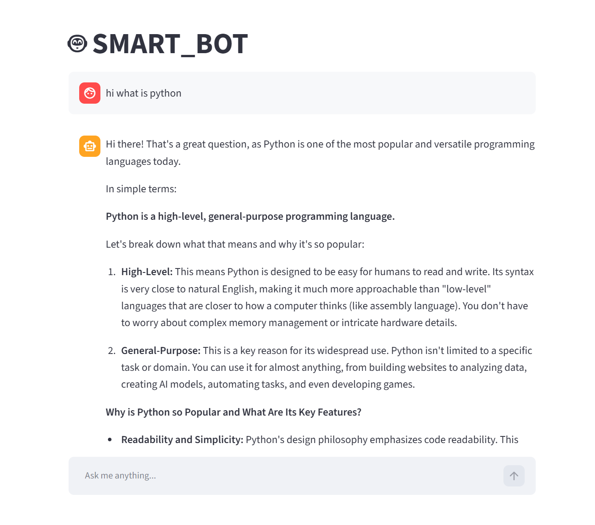

# AI-Chatbot-Streamlit

A simple chatbot application built using Streamlit and Google's Gemini API.

## Live Demo

https://ai-chatbot-icecream.streamlit.app/

## Screenshot



## Features

* Chat interface built with Streamlit
* Responses generated using Gemini
* Session-based chat history
* API key management using environment variables

## Tech Stack

* Python
* Streamlit
* Google Gemini API
* python-dotenv

## Installation

### Clone the repository

```bash
git clone https://github.com/your-username/AI-Chatbot-Streamlit.git
cd AI-Chatbot-Streamlit
```

### Create a virtual environment

```bash
python -m venv .venv
```

### Activate the environment

**Windows**

```bash
.venv\Scripts\activate
```

**Linux / Mac**

```bash
source .venv/bin/activate
```

### Install dependencies

```bash
pip install -r requirements.txt
```

### Create a .env file

```env
GOOGLE_API_KEY=your_api_key_here
```

## Running the Application

```bash
streamlit run app.py
```

The application will start in your browser.

## Project Structure

```text
AI-Chatbot-Streamlit/
├── app.py
├── .env
├── .gitignore
├── requirements.txt
├── README.md
└── images/
    └── screenshot.png
```

## How It Works

1. User enters a prompt through the Streamlit chat interface.
2. The prompt is sent to the Gemini model.
3. Gemini generates a response.
4. The response is displayed in the chat window.
5. Conversation history is stored using Streamlit session state.

## Learning Outcomes

This project helped me understand:

* API integration
* Environment variables
* Streamlit application development
* Session state management
* Working with Large Language Models (LLMs)

## Future Improvements

* Streaming responses
* Persistent chat history
* Multiple model selection
* User authentication
* Chat export functionality
